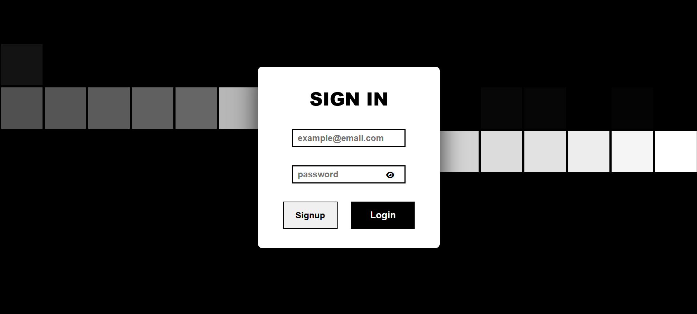

# Login Page

A modern, responsive login page built with HTML, CSS, and JavaScript.

## Live Demo

[View Live Site](https://loginpagex9.netlify.app/)

## GitHub Repository

[https://github.com/sandman-sh/login-page.git](https://github.com/sandman-sh/login-page.git)

## Features
- Responsive design for desktop and mobile
- Animated background with interactive hover effects
- Stylish login form with email and password fields
- Password visibility toggle (show/hide password)
- Font Awesome icons for enhanced UI
- Clean and modern UI/UX

## Usage
1. **Clone the repository:**
   ```bash
   git clone https://github.com/sandman-sh/login-page.git
   ```
2. **Open `index.html` in your browser.**

## File Structure
- `index.html` – Main HTML file containing the login form and layout
- `style.css` – CSS for layout, animations, and responsive design
- `script.js` – JavaScript for password visibility toggle

## Screenshot


## License
This project is open source and available under the [MIT License](LICENSE).

---

> Inspired by modern web design practices. Feel free to use and modify for your own projects! 
